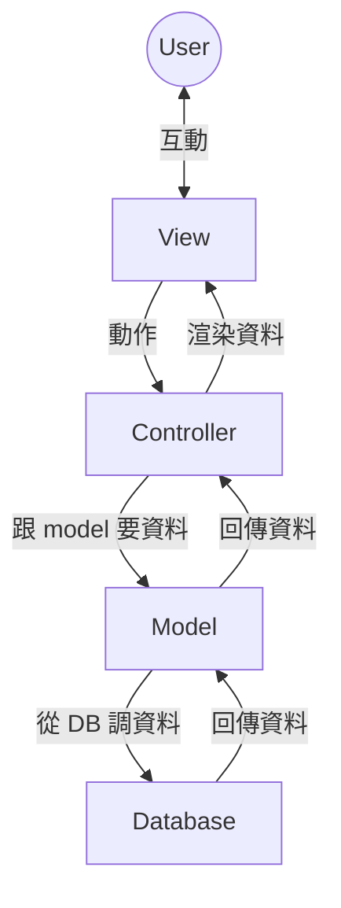

# Food-Pangolin
1131軟體工程期末專題  
第十二組  
111213001 葉芷妤 111213012 郭方朔 111213066 蔡家生 111213070 郭于擎  


## MVC
```
project/
├── app/
│   ├── __init__.py       # 初始化 Flask
│   ├── controllers/
│   │   ├── customer_controller.py
│   │   ├── merchant_controller.py
│   │   ├── delivery_person_controller.py
│   │   ├── order_controller.py
│   │   ├── feedback_controller.py
│   │   └── menu_item_controller.py
│   │
│   ├── models/
│   │   ├── __init__.py   # 初始化 SQL 模組
│   │   ├── customer.py
│   │   ├── merchant.py
│   │   ├── delivery_person.py
│   │   ├── order.py
│   │   ├── order_item.py
│   │   ├── feedback.py
│   │   └── menu_item.py
│   │
│   ├── templates/
│   │   ├── customer/
│   │   │   ├── browse_menu.html
│   │   │   ├── place_order.html
│   │   │   └── order_history.html
│   │   ├── merchant/
│   │   │   ├── dashboard.html
│   │   │   ├── manage_menu.html
│   │   │   └── order_list.html
│   │   ├── delivery_person/
│   │   │   ├── assigned_orders.html
│   │   │   ├── update_status.html
│   │   │   └── delivery_history.html
│   │   └── shared/
│   │       ├── layout.html
│   │       └── navbar.html
│   │
│   └── static/
│       ├── css/
│       │   ├── style.css
│       │   └── merchant.css
│       ├── js/
│       │   ├── scripts.js
│       │   └── customer.js
│       └── images/
│           ├── logo.png
│           └── banner.jpg
│
├── config/
│   ├── __init__.py
│   ├── settings.py       # 設定檔案 (如資料庫帳密設定)
│   ├── routes.py         # 路由設計
│   └── database.py       # 初始化資料庫連線
│
├── tests/
│   ├── test_customer_controller.py
│   ├── test_order_controller.py
│   ├── test_feedback_flow.py
│   └── test_order_flow.py
│
├── .env                  # 環境變數
├── .gitignore
├── README.md
├── requirements.txt      # 版本控制
└── run.py                # 入口
```
### MVC 流程示例

> 感謝吳楷賀提供 https://hackmd.io/q2GW1NTCQpmxmj3Rl3zLug?view
