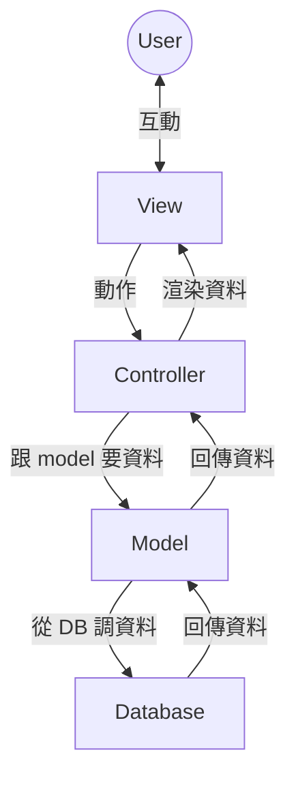

# Food-Pangolin
1131軟體工程期末專題  
## 第十二組  
111213001 葉芷妤 111213012 郭方朔 111213066 蔡家生 111213070 郭于擎  
## 最後 progect 為 Final 分支


## MVC
```
Food-Pangolin/
├── app/
│   ├── __init__.py       # 初始化 Flask
│   ├── controllers/
│   │   ├── customer_app.py
│   │   ├── restaurant_app.py
│   │   ├── delivery_app.py
│   │   ├── platform_app.py
│   │   └── auth_app.py
│   │
│   ├── dbUtils/
│   │   ├── login.py   # 統一的 function
│   │   ├── customer_dbUtils.py
│   │   ├── delivery_dbUtils.py
│   │   ├── platform_dbUtils.py
│   │   └── restaurant_dbUtils.py
│   │
│   ├── templates/ # html 檔案
│   │   ├── customer/
│   │   │   ├── car.html
│   │   │   ├── ...
│   │   │   └── reviews.html
│   │   ├── restaurant/
│   │   │   ├── add_menu.html
│   │   │   ├── ...
│   │   │   └── Restaurant_information.html
│   │   ├── delivery/
│   │   │   ├── deliver_home.html
│   │   │   ├── ...
│   │   │   └── register_deliver.html
│   │   └── platform/
│   │   │   ├── customer_payments.html
│   │   │   ├── ...
│   │   │   └── merchant_earnings.html
│   │   ├── login.html
│   │   └── register.html
│   │
│   └── static/
│       ├── css/
│       │   └── style.css
│       └── scripts.js
│       ├── img.jpg # 餐廳 menu 圖
│       ├── img.jpg
│       ├── ...
│
│
├── .gitignore
├── README.md
├── food_pangolin.sql     # 資料庫檔案
└── run.py                # 入口
```
### MVC 流程示例

```mermaid
flowchart TB
    A((User)) <-->|互動| B[View]
    B -->|動作| C[Controller]
    C -->|跟 model 要資料| D[Model]
    D -->|從 DB 調資料| E[Database]
    E -->|回傳資料| D
    D -->|回傳資料| C
    C -->|渲染資料| B
```
> 感謝吳楷賀提供 https://hackmd.io/q2GW1NTCQpmxmj3Rl3zLug?view
